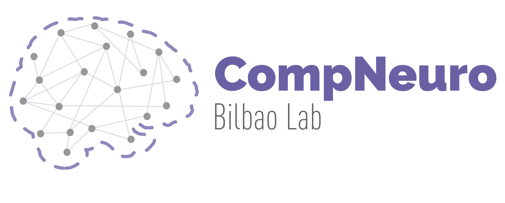

# compneuro-dwiproc
This repo conatins the dwi preprocessing and analysis code used by the Computational Neuroimaging Lab at Biocruces Bizkaia HRI. 



## Prerequisites
### Software
All the code can be executed using docker. To build the image you need to install first [docker](https://docs.docker.com/engine/install/) and make:

```bash
sudo apt install make
```

But, if you want to install all neuroimaging software used to preprocess the data, here you have the list! 

* [ANTs](http://stnava.github.io/ANTs/)
* [MRtrix3](https://mrtrix.readthedocs.io/en/dev/index.html)
* [FSL](https://fsl.fmrib.ox.ac.uk/fsl/fslwiki)
* [Convert3D](http://www.itksnap.org/pmwiki/pmwiki.php?n=Convert3D.Documentation)
* [Nilearn](https://nilearn.github.io/stable/index.html)

### Data structure
Raw data should be stored in [BIDS format](https://bids.neuroimaging.io/) inside a folder named "data"

Also, You need a folder with the brain extracted images and a folder with the tissue-priors segmentations. You can use our pipeline also to a better integration! [compneuro-anatpreproc](https://github.com/ajimenezmarin/compneuro-anatproc). But, if you want to use another software (or your own code), you need the following folder structure and files:

```
/path/to/your/project/
├──Preproc
│   ├── Anat
│   │   ├── sub-XXX_acpc
│   │   │   ├── sub-XXX_acpc.nii.gz
│   ├── BET
│   │   ├── sub-XXX_T1w_brain.nii.gz
│   ├── ProbTissue
│   │   ├── sub-XXX_T1w_brain_corticalGM.nii.gz
│   │   ├── sub-XXX_T1w_brain_CSF.nii.gz
│   │   ├── sub-XXX_T1w_brain_subcorticalGM.nii.gz
│   │   ├── sub-XXX_T1w_brain_WM.nii.gz
```

## Getting started

First, create an environment variable where your data is placed. 

```bash
export PROJECT_PATH=/path/to/your/project
```

You can now build the docker container:

```bash
sudo make build
sudo make dev
```

### Usage
```bash
/app/src/dwi_launcher.sh <partition>
```

* **partition**: brain partition used for computing the connectivity matrices. It should be in the MNI152_2mm space and dimensions. 

## Ouputs

The main outputs will be placed in the folder `/path/to/your/project/Preproc/Dwiprep`

Inside, you will find a subfolder for each subject with the tensor-fitted images (i.e. Fractional anisotropy *dwi_FA.nii.gz*, Medial diffusivity *dwi_MD.nii.gz*, Radial diffusivity *dwi_RD.nii.gz*, and Axial diffusivity *dwi_AD.nii.gz*). Furthermore you will find the SC matrices of the probabilistic *iFOD2* and deterministic *FACT* tractographies containing the fiber counting in the partition introduced as input.

## Cite
Please, if you want to use this code in your publications, cite this work:

**Multimodal and multidomain lesion network mapping enhances prediction of sensorimotor behavior in stroke patients**.
Antonio Jimenez-Marin, Nele De Bruyn, Jolien Gooijers, Alberto Llera, Sarah Meyer, Kaat Alaerts, Geert Verheyden, Stephan P. Swinnen, Jesus M. Cortes.
*SciRep*. 2022. doi: https://doi.org/10.1038/s41598-022-26945-x


